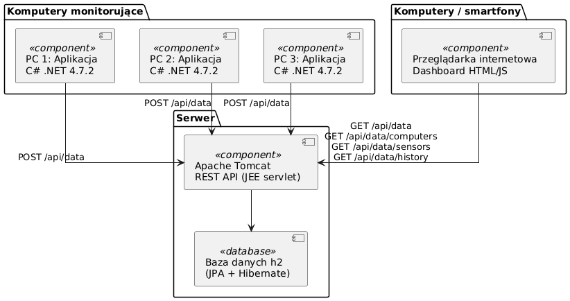
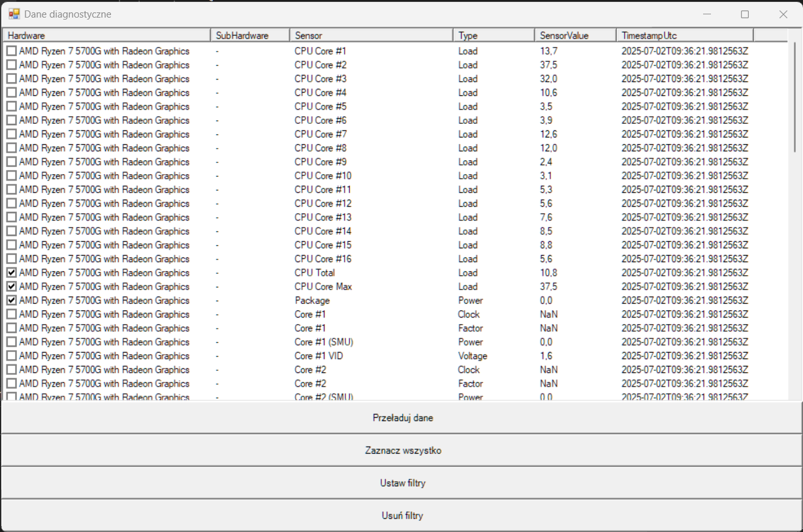
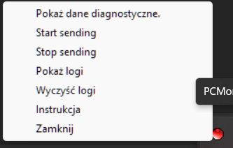
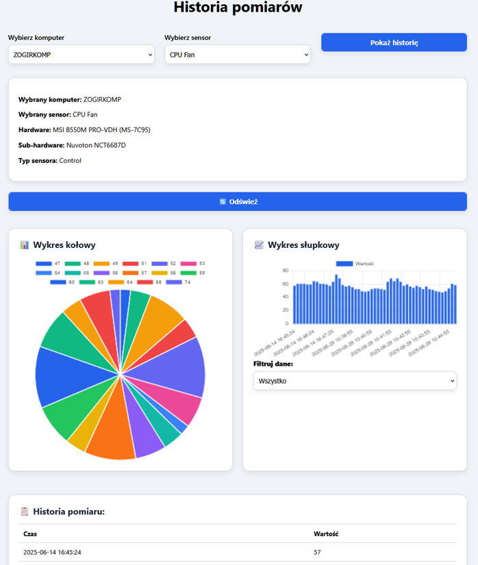

# PCMonitorSuite

**PCMonitorSuite** is a system for monitoring a computer's hardware diagnostics (temperatures, CPU/GPU usage, memory, etc.), loading data locally and periodically sending it to a REST API server. The project consists of two three components: a Windows application - PCMonitorClient, backend REST API server - PCMonitorServer and html/js web dashboard.

---

## System Architecture

### Client Application – `PCMonitorClient`
- Written in **C#** (.NET)
- Graphical User Interface made using Windows.Forms libraries
- Runs in the background as a tray icon on the taskbar
- Viewing diagnostics in a separate window
- Local logging to .log file
- Automatic data collection every 10 seconds (using LibreHardwareMonitor),
- Automatic sending JSON data every 10 seconds to PCMonitorServer

### REST API Server – `PCMonitorServer`
- REST API written in **Java (Jakarta EE)**
- Receives diagnostic data in JSON format
- Storing data in h2 database
- Provides simple endpoints:
  - `POST /api/data` – receive diagnostic data from the PCMonitorClient
  - `GET /api/data` – get latest data that came to the server
  - `GET /api/data/computers` - get all computers
  - `GET /api/data/sensor` - get all sensors
  - `GET /api/data/history?computerId=xx&sensorId=xx` - get sensor readings history by computerId and sensorId

### Web Dashboard
- Written in html/js
- Selection of computer and sensor for analysis
- Displaying the history of readings of the selected sensor in table, chart format
- Pie chart and bar chart made in chart.js

## Screenshots

### Diagnostic Data view (on PCMonitorClient)

### Tray Icon view (on PCMonitorClient)

### Web Dashboard view

---

## Requirements
To build from source, make sure you have the following:

### PCMonitorClient (desktop application)
- Windows 10/11 (x64)
- Visual Studio 2019 or newer
- .NET Framework 4.7.2 or higher
- LibreHardwareMonitorLib.0.9.4
- HidSharp.2.1.0
- Newtonsoft.Json.13.0.3
- System.CodeDom.9.0.0
- System.Management.9.0.0

### PCMonitorServer (backend)
- Java 11+
- Apache NetBeans (or any IDE with Jakarta EE support)
- Maven
- REST API deployed on local or remote server (e.g., Tomcat)
- jakartaee 10.0.0
- hibernate 5.2.10.Final
- h2database 1.4.193
- javax.xml.bind 2.3.0
- com.google.code.gson

---

## Build and run

### Diagnostic Client
1. Open the `PCMonitorClient.sln` in Visual Studio.
2. Install required dependencies listed "Requirements" section (for example by NUGet packages in Visual Studio)
3. Build the PCMonitorClient project (`Ctrl + Shift + B`).
4. Run `PCMonitor.exe` from `bin/Debug` or `bin/Release`.

### Server
1. Open the `PCMonitorServer` project in Apache NetBeans.
2. Run it on a Java EE server (for example: Apache Tomcat 10.1 configured in Apache Netbeans).
3. Ensure the `/PCMonitorClient endpoint is available at `http://localhost:8080/PCMonitorClient`.

---

## Security (TODO)
- No authentication 
- No encryption 

---

## Planned Features
- Export data to CSV
- System notifications
- Client-server authentication
- Additional configurations in diagnostic client (PCMonitorClient)
- Improvement of web dashboard: add more options for better data visualisation

---

## License

This project is licensed under the [MIT License](https://opensource.org/licenses/MIT).

See the [LICENSE](LICENSE) file for details.

